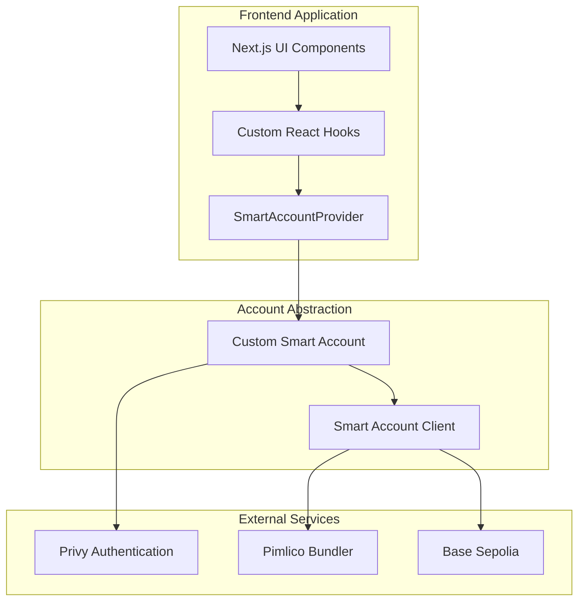
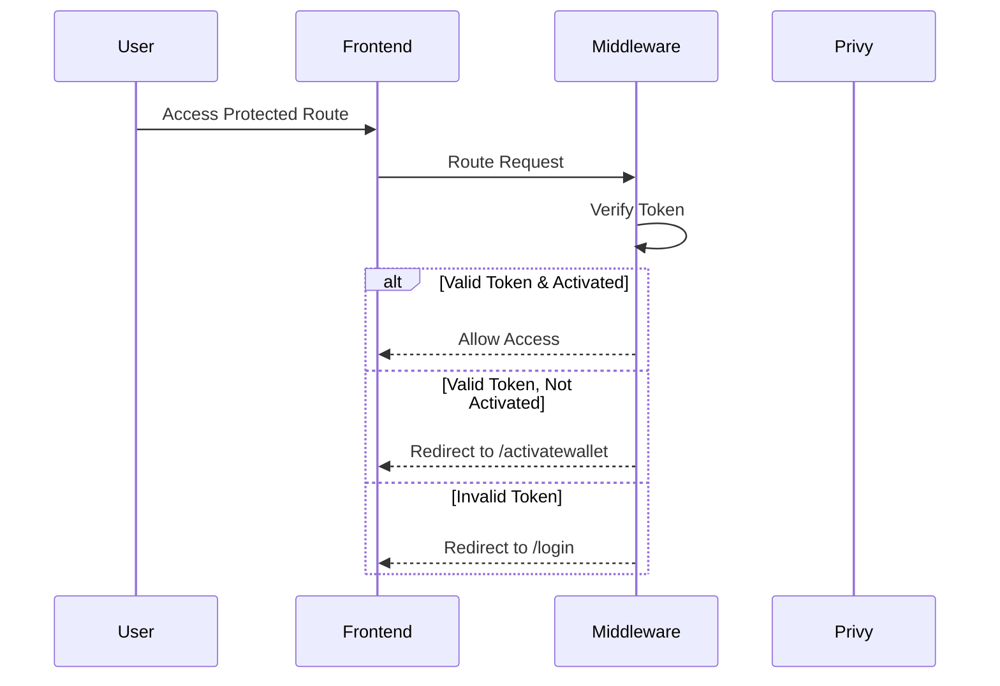

# KAIROS Frontend

A Next.js application providing a seamless ERC-4337 account abstraction interface for personal accountability task management. Users interact through smart accounts with gasless transactions, social authentication, and automated task enforcement.

For the contracts repo see [Kairos Contract](https://github.com/Stoneybro/kairos-contract)

For the full technical specification, see 📄 [Technical Specification](SPECIFICATION.md)


https://github.com/user-attachments/assets/4352f475-3ace-40b9-8be0-787e5b81d114


## Overview

The KAIROS frontend is the user interface for the KAIROS accountability wallet smart contract system. It enables users to interact with their personal SmartAccount contracts and manage accountability tasks through the TaskManager, all while abstracting away blockchain complexity through account abstraction.

**Smart Contract Integration**:
The frontend directly interfaces with three core contracts:
- **SmartAccount**: Personal ERC-4337 wallet handling fund management and task integration
- **TaskManager**: Centralized task storage with min-heap expiration scheduling
- **AccountFactory**: Deterministic SmartAccount deployment using minimal proxy pattern

Users authenticate via social logins, deploy deterministic smart accounts, and manage accountability tasks with automatic penalty enforcement—all without gas fees or traditional wallet management.

### Key Features

- **Account Abstraction**: Full ERC-4337 implementation with smart account interface
- **Gasless Transactions**: Pimlico paymaster integration for sponsored operations
- **Social Authentication**: Privy integration supporting Google, Twitter, email, and phone
- **Smart Account Abstraction**: EOA complexity hidden from users
- **Real-time State Management**: TanStack Query for blockchain state synchronization
- **Robust Error Handling**: Graceful degradation and automatic retry mechanisms

## Architecture



The system implements a three-layer architecture:
- **Presentation Layer**: Next.js pages and React components
- **Business Logic**: Smart account management and transaction orchestration  
- **Integration Layer**: Blockchain, authentication, and bundler services

## Technology Stack

### Core Framework
- **Next.js 13**: App Router with server-side rendering
- **React 18**: Component architecture with concurrent features
- **TypeScript**: Full type safety across the application

### Blockchain Integration
- **Viem**: Type-safe Ethereum client and utilities
- **Permissionless.js**: ERC-4337 account abstraction library
- **Custom Smart Account**: Wrapper around Viem's `toSmartAccount`

### Authentication & UX
- **Privy**: Social authentication and secure key management
- **Pimlico**: UserOperation bundling and paymaster services
- **TanStack Query**: Server state management and caching

### Styling & UI
- **Tailwind CSS**: Utility-first styling framework
- **Sonner**: Toast notifications for user feedback

## Smart Account Implementation

### Account Abstraction Flow

The application implements a sophisticated account abstraction layer that hides EOA complexity:

```typescript
// Users only interact with smart account addresses
const smartAccountAddress = await accountFactory.getAddressForUser(userEOA);

// All transactions go through UserOperations
const userOpHash = await smartAccountClient.sendUserOperation({
  account: smartAccount,
  calls: [{ to: targetContract, data: encodedCallData }],
});
```

### Key Design Decisions

**EOA Abstraction**: Users never see or interact with their underlying EOA. The private key is managed by Privy and only surfaces during signature prompts.

**Deterministic Addresses**: Smart account addresses are predictable using `keccak256(abi.encodePacked(owner))` as salt, enabling seamless backend integration.

**Gasless UX**: All operations are sponsored through Pimlico paymaster integration, removing gas payment friction.

**Signature Isolation**: EOA private keys remain secure within Privy's custody solution and never touch frontend code.

## Environment Setup

### Required Environment Variables

```bash
# Privy Configuration
NEXT_PUBLIC_PRIVY_APP_ID=your_privy_app_id
PRIVY_APP_SECRET=your_privy_app_secret

# Pimlico Configuration  
NEXT_PUBLIC_PIMLICO_API_KEY=your_pimlico_api_key
NEXT_PUBLIC_PIMPLICO_SPONSOR_ID=your_sponsorship_policy_id

# Application Configuration
NEXT_PUBLIC_BASE_URL=http://localhost:3000
NEXTAUTH_SECRET=your_nextauth_secret
```

### Smart Contract Addresses

```typescript
export const CONTRACT_ADDRESSES = {
  ACCOUNT_FACTORY: "0x...", // Your deployed AccountFactory
  TASK_MANAGER: "0x...",    // Your deployed TaskManager
  ENTRY_POINT: "0x5FF137D4b0FDCD49DcA30c7CF57E578a026d2789", // EntryPoint v0.6
} as const;
```

## Development

### Local Setup

```bash
# Clone and install dependencies
git clone https://github.com/your-username/kairos-frontend
cd kairos-frontend
npm install

# Configure environment
cp .env.example .env.local
# Edit .env.local with your API keys

# Start development server
npm run dev
```

### Project Structure

```
src/
├── app/                    # Next.js 13 App Router
│   ├── dashboard/         # Main dashboard page
│   ├── login/             # Authentication page
│   └── activatewallet/    # Account activation flow
├── components/            # Reusable UI components
├── lib/                   # Core utilities and hooks
│   ├── hooks/            # Custom React hooks for blockchain
│   ├── contracts/        # Contract ABIs and addresses
│   ├── smartAccountProvider.tsx
│   ├── customSmartAccount.ts
│   └── smartAccountClient.ts
└── middleware.ts          # Authentication middleware
```

## Custom Hooks Architecture

The application uses a consistent pattern for blockchain interactions:

### Task Management Integration

The frontend provides interfaces for the complete task lifecycle managed by the smart contracts:

```typescript
// Create tasks with penalty mechanisms
const { mutate: createTask } = useCreateTask(smartAccountAddress);

createTask({
  taskTitle: "Complete project milestone",
  taskDescription: "Finish authentication module",
  rewardAmount: parseEther("0.1"),        // 0.1 ETH reward
  deadlineInSeconds: BigInt(7 * 24 * 60 * 60), // 7 days
  penaltyChoice: 1,                       // PENALTY_DELAYEDPAYMENT
  delayPayment: BigInt(2 * 24 * 60 * 60), // 2 day delay
  verificationMethod: 0,                  // Manual verification
});

// Complete tasks to release committed funds
const { mutate: completeTask } = useCompleteTask(smartAccountAddress);

// Handle penalty scenarios
const { mutate: releaseDelayedPayment } = useReleaseDelayedPayment(smartAccountAddress);
```

### Smart Contract State Synchronization

React Query maintains real-time sync with contract state:

```typescript
// Query TaskManager functions
useTasksByStatus(account, TaskStatus.ACTIVE);     // TaskManager.getTasksByStatus()
useTotalTasks(account);                           // TaskManager.getTotalTasks()
useTaskCountsByStatus(account);                   // TaskManager.getTaskCountsByStatus()

// Query SmartAccount state  
useAccountBalance(account);                       // ETH balance
useCommittedRewards(account);                     // s_totalCommittedReward
```

### Smart Account Deployment Flow

The frontend handles automatic SmartAccount deployment through the AccountFactory:

```typescript
// Address prediction (before deployment)
const predictedAddress = await accountFactory.read.getAddressForUser([userEOA]);

// Automatic deployment on first transaction
const factoryArgs = {
  factory: CONTRACT_ADDRESSES.ACCOUNT_FACTORY,
  factoryData: encodeFunctionData({
    abi: ACCOUNT_FACTORY_ABI,
    functionName: "createAccount", 
    args: [userEOA], // Owner address from Privy
  }),
};

// Factory prevents duplicate deployments via userClones mapping
```

### Penalty System Integration

The UI supports both penalty mechanisms defined in the SmartAccount contract:

**Delayed Payment Penalty** (Type 1):
- Funds locked for additional time after task expiration
- User can release funds after delay period via `SmartAccount.releaseDelayedPayment()`

**Buddy Transfer Penalty** (Type 2):
- Funds immediately transferred to designated buddy address
- Automatic execution via `SmartAccount.expiredTaskCallback()`

```typescript
// Penalty configuration in task creation
const penaltyConfig = {
  choice: 1, // PENALTY_DELAYEDPAYMENT constant from contract
  delayDuration: 2 * 24 * 60 * 60, // 2 days in seconds
  buddy: "0x0000000000000000000000000000000000000000", // Not used for delayed payment
};
```

## Authentication & Middleware

### Authentication Flow



### Grace Mode

The middleware implements "grace mode" for resilient authentication:

```typescript
// Allow limited access during temporary auth failures
if (authFailed && GRACE_MODE_ENABLED) {
  return NextResponse.next({
    headers: { 'x-auth-grace': '1' }
  });
}
```

This prevents complete application lockout during brief authentication service disruptions.

## Error Handling

### Transaction Error Recovery

```typescript
export function useTransactionErrorHandler() {
  return (error: unknown) => {
    if (error.message.includes("insufficient funds")) {
      toast.error("Insufficient balance for this operation");
    } else if (error.message.includes("user rejected")) {
      toast.error("Transaction cancelled by user");
    } else {
      toast.error("Transaction failed. Please try again.");
      console.error("Transaction error:", error);
    }
  };
}
```

### Initialization Resilience

Smart account initialization includes exponential backoff retry logic:

- **Initial Retry**: 1 second delay
- **Exponential Backoff**: Doubles delay up to 60 seconds maximum
- **Window Focus Recovery**: Automatic retry when user returns to tab
- **Error State Management**: Clear error messaging with retry options

## State Management

### React Query Configuration

```typescript
const queryClient = new QueryClient({
  defaultOptions: {
    queries: {
      staleTime: 30_000,        // 30 seconds
      gcTime: 5 * 60_000,       // 5 minutes  
      refetchOnWindowFocus: true,
      retry: 3,
    },
  },
});
```

### Cache Invalidation Strategy

Strategic cache invalidation ensures UI consistency:

```typescript
// After successful task creation
onSuccess: () => {
  queryClient.invalidateQueries({ queryKey: ["tasks", smartAccount] });
  queryClient.invalidateQueries({ queryKey: ["dashboardBalance", smartAccount] });
  queryClient.invalidateQueries({ queryKey: ["taskCount", smartAccount] });
}
```

## Security Considerations

### Frontend Security
- **Content Security Policy**: Prevents XSS attacks
- **Secure Headers**: Implemented via middleware
- **Input Validation**: All user inputs sanitized
- **Environment Variables**: Sensitive data properly scoped

### Blockchain Security
- **Signature Domain Separation**: EIP-712 prevents replay attacks
- **Nonce Management**: EntryPoint handles replay protection
- **Gas Estimation**: Safe gas limits with buffer margins
- **Error Boundaries**: Prevent crashes from propagating

## Deployment

### Build Configuration

```json
{
  "scripts": {
    "build": "next build",
    "start": "next start",
    "lint": "next lint --fix",
    "type-check": "tsc --noEmit"
  },
  "experimental": {
    "optimizePackageImports": ["@privy-io/react-auth", "permissionless"]
  }
}
```

### Production Checklist

- [ ] Environment variables configured
- [ ] Contract addresses updated for target network
- [ ] API keys rotated and secured  
- [ ] Error monitoring integrated
- [ ] Performance monitoring enabled
- [ ] Security headers configured

## Known Limitations

### Current Constraints
- **Single Chain and token Support**: Currently limited to Base Sepolia 
- **Single token Support**: Currently limited to Base Sepolia eth
- **Manual Task verification**

### Planned Improvements
- Multi-chain support 
- offchain accountability partner verification
- UI restructure


## License

MIT License - see [LICENSE](LICENSE) file for details.

## Disclaimer

This application is in active development and has not undergone security audits. Use with testnet funds only. The smart account system handles real cryptographic keys and blockchain transactions—exercise appropriate caution.

---

*Built with ❤️ for better personal accountability through blockchain technology.*
