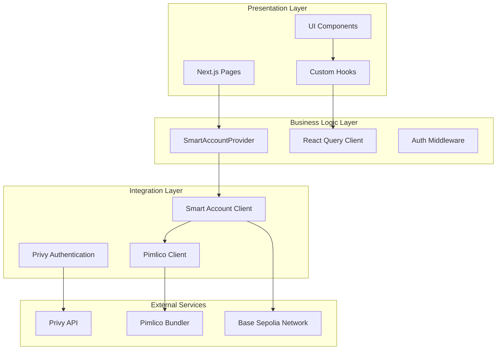
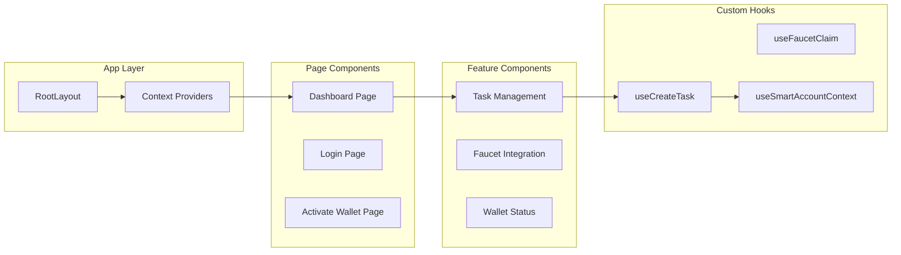
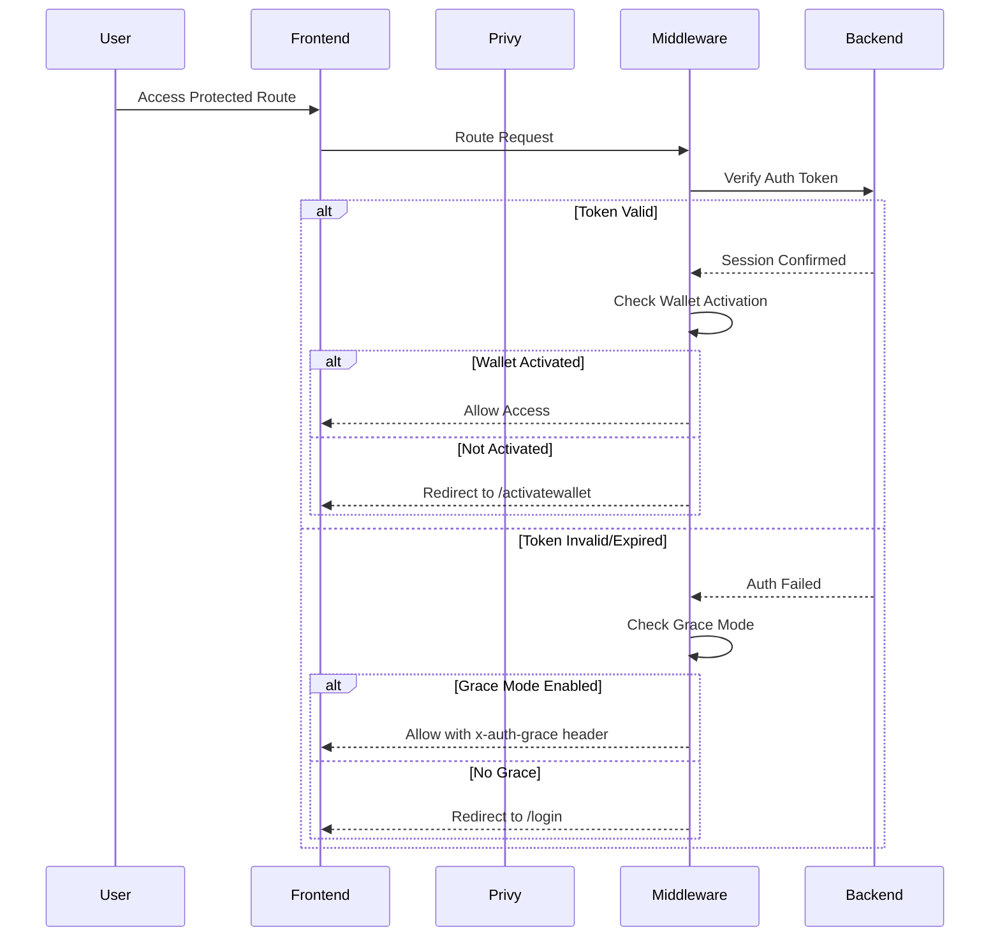
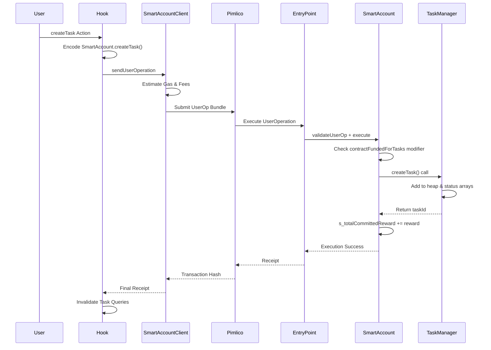

# KAIROS Frontend - Technical Specification

## Table of Contents
1. [System Overview](#system-overview)
2. [Architecture Design](#architecture-design)
3. [Authentication & Session Management](#authentication--session-management)
4. [Account Abstraction Implementation](#account-abstraction-implementation)
5. [Transaction Management](#transaction-management)
6. [State Management](#state-management)
7. [Error Handling & Resilience](#error-handling--resilience)
8. [Security Considerations](#security-considerations)
9. [Performance Optimizations](#performance-optimizations)
10. [API Integration](#api-integration)

## System Overview

The KAIROS frontend is a Next.js 13 application serving as the user interface for the KAIROS accountability wallet smart contract system. It provides a complete ERC-4337 account abstraction interface that connects users to their SmartAccount contracts, enabling interaction with the TaskManager for accountability task management. The system abstracts away EOA complexity, presenting users with a unified smart account interface while leveraging social authentication and gasless transactions.

**Smart Contract Integration**:
- **SmartAccount Contract**: Each user deploys a personal ERC-4337 compatible wallet
- **TaskManager Contract**: Centralized task lifecycle management with min-heap scheduling  
- **AccountFactory Contract**: Deterministic SmartAccount deployment using minimal proxy pattern

### Core Objectives
- **Seamless UX**: Abstract blockchain complexity through account abstraction
- **Gasless Operations**: Enable transaction sponsorship via Pimlico paymaster integration
- **Social Authentication**: Provide familiar login patterns through Privy integration
- **Real-time State**: Maintain synchronization between blockchain and UI state
- **Robust Error Handling**: Graceful degradation and recovery mechanisms

### Technology Stack
- **Framework**: Next.js 13 (App Router)
- **Blockchain**: Viem + Permissionless.js for ERC-4337
- **Authentication**: Privy (social wallets + custody)
- **State Management**: TanStack Query (React Query)
- **Styling**: Tailwind CSS
- **Infrastructure**: Pimlico (bundler + paymaster)

## Architecture Design

### Layered Architecture



### Component Architecture



## Authentication & Session Management

### Authentication Flow

The system implements a multi-layered authentication approach combining Privy's social authentication with custom middleware validation:



### Middleware Implementation

The authentication middleware (`middlewareAuth.ts`) implements sophisticated routing logic:

```typescript
// Simplified middleware logic
export async function authMiddleware(request: NextRequest) {
  const { authenticated, session } = await verifyAuth(request);
  
  if (!authenticated) {
    if (GRACE_MODE_ENABLED) {
      return NextResponse.next({
        headers: { 'x-auth-grace': '1' }
      });
    }
    return redirect('/login');
  }
  
  if (!session.walletActivated) {
    return redirect('/activatewallet');
  }
  
  // Prevent authenticated users from accessing auth pages
  if (isAuthPage(request.pathname)) {
    return redirect('/dashboard');
  }
  
  return NextResponse.next();
}
```

**Grace Mode**: Allows limited frontend functionality during temporary authentication failures, improving UX resilience.

## Account Abstraction Implementation

### Smart Account Architecture

The frontend implements a custom ERC-4337 smart account wrapper using Viem's `toSmartAccount` function:

```typescript
interface CustomSmartAccountConfig {
  // Account address prediction
  getAddress(): Promise<`0x${string}`>;
  
  // Factory deployment parameters
  getFactoryArgs(): Promise<{
    factory: `0x${string}`;
    factoryData: `0x${string}`;
  }>;
  
  // Nonce management
  getNonce(): Promise<bigint>;
  
  // Signature methods
  signMessage(params: SignMessageParameters): Promise<`0x${string}`>;
  signTypedData(typedData: TypedData): Promise<`0x${string}`>;
  signUserOperation(userOp: UserOperation): Promise<`0x${string}`>;
}
```

### Address Derivation Strategy

Smart account addresses are deterministically derived using the AccountFactory contract pattern:

```solidity
// AccountFactory.getAddressForUser(owner) implementation:
bytes32 salt = keccak256(abi.encodePacked(owner));
address predicted = Clones.predictDeterministicAddress(implementation, salt);
```

This matches the on-chain factory logic, ensuring frontend and contract address predictions are synchronized.

**Integration with AccountFactory**:
- Frontend calls `AccountFactory.getAddressForUser(userEOA)` for address prediction
- Deployment triggered via `AccountFactory.createAccount(owner)` when needed
- Factory prevents duplicate deployments through `userClones` mapping

### UserOperation Signing Process

The system implements EIP-712 domain separation for secure UserOperation signing:

```typescript
async function signUserOperation(userOperation: UserOperation) {
  // Get userOpHash from EntryPoint
  const userOpHash = await entryPoint.read.getUserOpHash([userOperation]);
  
  // EIP-712 domain for EntryPoint v0.6
  const domain = {
    name: "EntryPoint",
    version: "0.6",
    chainId: await publicClient.getChainId(),
    verifyingContract: ENTRY_POINT_ADDRESS,
  };
  
  const types = {
    UserOperation: [{ name: "userOpHash", type: "bytes32" }]
  };
  
  // Sign via Privy's typed data signing
  return privySignTypedData({
    domain,
    types,
    primaryType: "UserOperation",
    message: { userOpHash },
  });
}
```

### Transaction Management

### UserOperation Lifecycle for KAIROS Contracts



### Contract Function Mapping

The frontend hooks directly map to SmartAccount contract functions:

```typescript
// Task lifecycle operations
useCreateTask() → SmartAccount.createTask()
useCompleteTask() → SmartAccount.completeTask()  
useCancelTask() → SmartAccount.cancelTask()
useReleaseDelayedPayment() → SmartAccount.releaseDelayedPayment()

// Fund management
useSend() → SmartAccount.execute() // ETH transfers
useFaucetClaim() → SmartAccount.execute() // Faucet interactions

// Account deployment
AccountFactory.createAccount() → Triggered automatically on first transaction
```

### Custom Hook Pattern

All blockchain interactions follow a consistent hook pattern:

```typescript
export function useCreateTask(smartAccount: `0x${string}`) {
  const { getClient } = useSmartAccountContext();
  const queryClient = useQueryClient();

  return useMutation({
    mutationFn: async (payload: CreateTaskArgsType) => {
      const client = await getClient();
      
      const callData = encodeFunctionData({
        abi: SMART_ACCOUNT_ABI,
        functionName: "createTask",
        args: [...payload.args],
      });

      const hash = await client.sendUserOperation({
        account: client.account,
        calls: [{ to: smartAccount, data: callData, value: 0n }],
      });

      return client.waitForUserOperationReceipt({ hash });
    },
    
    onSuccess: () => {
      // Selective cache invalidation
      queryClient.invalidateQueries({ queryKey: ["tasks", smartAccount] });
      queryClient.invalidateQueries({ queryKey: ["dashboardBalance", smartAccount] });
    },
  });
}
```

### Gas Management Strategy

The system implements dynamic gas estimation through Pimlico integration:

```typescript
export async function getSmartAccountClient(account: CustomSmartAccount) {
  return createSmartAccountClient({
    account,
    chain: baseSepolia,
    bundlerTransport: http(pimlicoBundlerUrl),
    paymaster: pimlicoClient,
    userOperation: {
      estimateFeesPerGas: async () =>
        (await pimlicoClient.getUserOperationGasPrice()).fast,
    },
  });
}
```

## State Management

### React Query Architecture

The application uses TanStack Query for comprehensive state management across blockchain operations:

```typescript
// Query key structure
const queryKeys = {
  tasks: (account: string) => ["tasks", account] as const,
  taskCount: (account: string) => ["taskCount", account] as const,
  balance: (account: string) => ["dashboardBalance", account] as const,
  activity: (account: string) => ["wallet-activity", account] as const,
} as const;
```

### Cache Invalidation Strategy

Strategic cache invalidation ensures UI consistency:

```typescript
// On successful task creation
onSuccess: () => {
  queryClient.invalidateQueries({ queryKey: ["tasks", smartAccount] });
  queryClient.invalidateQueries({ queryKey: ["dashboardBalance", smartAccount] });
  queryClient.invalidateQueries({ queryKey: ["taskCount", smartAccount] });
  queryClient.invalidateQueries({ queryKey: ["wallet-activity", smartAccount] });
}
```

### Task Data Integration

The frontend maintains synchronization with TaskManager contract state:

```typescript
// Query TaskManager contract functions
const queryKeys = {
  tasks: (account: string) => ["tasks", account] as const,           // TaskManager.getTasksByStatus()
  taskCount: (account: string) => ["taskCount", account] as const,   // TaskManager.getTotalTasks()
  balance: (account: string) => ["dashboardBalance", account] as const, // SmartAccount balance
  taskCounts: (account: string) => ["taskCounts", account] as const, // TaskManager.getTaskCountsByStatus()
} as const;

// Task status enum matches contract
enum TaskStatus {
  ACTIVE = 0,    // Task in progress, funds committed
  COMPLETED = 1, // Task finished, funds released  
  CANCELED = 2,  // Task canceled, funds released
  EXPIRED = 3,   // Task expired, penalty applied
}
```

### Penalty Mechanism Integration

The frontend handles both penalty types defined in the contracts:

```typescript
// Penalty type constants (from SmartAccount contract)
const PENALTY_DELAYEDPAYMENT = 1; // Delayed payment penalty
const PENALTY_SENDBUDDY = 2;      // Buddy transfer penalty

// Task creation with penalty configuration
const taskCreationPayload = {
  penaltyChoice: PENALTY_DELAYEDPAYMENT, // or PENALTY_SENDBUDDY
  delayPayment: delayDuration,           // For delayed payment (in seconds)
  sendBuddy: buddyAddress,               // For buddy transfer (address)
};

// Handle delayed payment release (post-expiration)
useReleaseDelayedPayment() → SmartAccount.releaseDelayedPayment()
```

## Error Handling & Resilience

### Initialization Resilience

The system implements exponential backoff for account initialization:

```typescript
class SmartAccountInitializer {
  private retryDelay = 1000; // Start at 1 second
  private maxDelay = 60000;  // Cap at 1 minute
  
  async initializeWithRetry() {
    try {
      return await this.initialize();
    } catch (error) {
      setTimeout(() => {
        this.initializeWithRetry();
      }, this.retryDelay);
      
      // Exponential backoff with cap
      this.retryDelay = Math.min(this.retryDelay * 2, this.maxDelay);
    }
  }
}
```

### Transaction Error Recovery

Comprehensive error handling for UserOperations:

```typescript
export function useTransactionErrorHandler() {
  return useCallback((error: unknown) => {
    if (error instanceof UserOperationError) {
      if (error.code === "INSUFFICIENT_FUNDS") {
        toast.error("Insufficient funds for transaction");
      } else if (error.code === "USER_OPERATION_REVERTED") {
        toast.error("Transaction failed: " + error.reason);
      }
    } else if (error instanceof NetworkError) {
      toast.error("Network error. Please try again.");
    } else {
      toast.error("Unexpected error occurred");
    }
    
    console.error("Transaction error:", error);
  }, []);
}
```

### Graceful Degradation

The system maintains functionality during partial failures:

- **Grace Mode**: Limited access during auth token issues
- **Offline Detection**: UI feedback for network connectivity
- **Retry Mechanisms**: Automatic retry for recoverable errors
- **Fallback States**: Alternative UI flows for error conditions

## Security Considerations

### Authentication Security

**Token Validation**: Middleware validates authentication tokens on every request
**Session Management**: Secure session handling with automatic refresh
**Route Protection**: Comprehensive route-based access control

### Smart Account Security

**Signature Isolation**: EOA private keys never exposed to frontend code
**Domain Separation**: EIP-712 prevents signature replay across contracts
**Nonce Management**: EntryPoint handles replay protection automatically

### Frontend Security

**XSS Prevention**: Content Security Policy and input sanitization
**CSRF Protection**: Next.js built-in CSRF protection
**Secure Headers**: Security headers configured in middleware

## Performance Optimizations

### Bundle Optimization

```typescript
// Dynamic imports for code splitting
const TaskCreationModal = dynamic(
  () => import("./TaskCreationModal"),
  { loading: () => <LoadingSpinner /> }
);
```

### Query Optimization

```typescript
// Prefetch critical data
export function usePrefetchAccountData(account: string) {
  const queryClient = useQueryClient();
  
  useEffect(() => {
    queryClient.prefetchQuery({
      queryKey: ["tasks", account],
      queryFn: () => fetchTasks(account),
      staleTime: 30000, // 30 seconds
    });
  }, [account, queryClient]);
}
```

### Caching Strategy

- **Query Stale Time**: 30 seconds for task data
- **Cache Time**: 5 minutes for inactive queries  
- **Background Updates**: Automatic refetch on window focus
- **Selective Invalidation**: Target specific query keys

## API Integration

### Backend Synchronization

The frontend maintains synchronization with backend services:

```typescript
export async function syncWalletOnServer(smartAccount: string) {
  try {
    await fetch("/api/sync-wallet", {
      method: "POST",
      headers: { "Content-Type": "application/json" },
      body: JSON.stringify({ smartAccount }),
    });
  } catch (error) {
    console.warn("Backend sync failed:", error);
    // Continue operation - not critical
  }
}
```

### Error Boundary Integration

```typescript
export function TransactionErrorBoundary({ children }: PropsWithChildren) {
  return (
    <ErrorBoundary
      fallback={<TransactionErrorFallback />}
      onError={(error) => {
        console.error("Transaction boundary error:", error);
        // Optional: Send to error reporting service
      }}
    >
      {children}
    </ErrorBoundary>
  );
}
```

## Deployment Considerations

### Environment Configuration

```typescript
// Environment validation
const config = {
  pimlicoApiKey: process.env.NEXT_PUBLIC_PIMLICO_API_KEY!,
  sponsorshipPolicyId: process.env.NEXT_PUBLIC_PIMPLICO_SPONSOR_ID!,
  privyAppId: process.env.NEXT_PUBLIC_PRIVY_APP_ID!,
  baseUrl: process.env.NEXT_PUBLIC_BASE_URL!,
} as const;

// Validate all required environment variables
Object.entries(config).forEach(([key, value]) => {
  if (!value) throw new Error(`Missing required environment variable: ${key}`);
});
```

### Build Optimization

```json
{
  "experimental": {
    "optimizePackageImports": ["@privy-io/react-auth", "permissionless"],
    "webpackBuildWorker": true
  },
  "compiler": {
    "removeConsole": {
      "exclude": ["error", "warn"]
    }
  }
}
```

---

*This specification represents the current implementation architecture. The system continues to evolve with additional features and optimizations.*